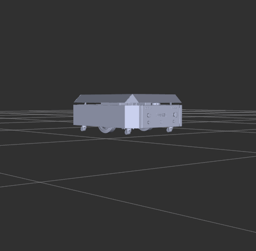
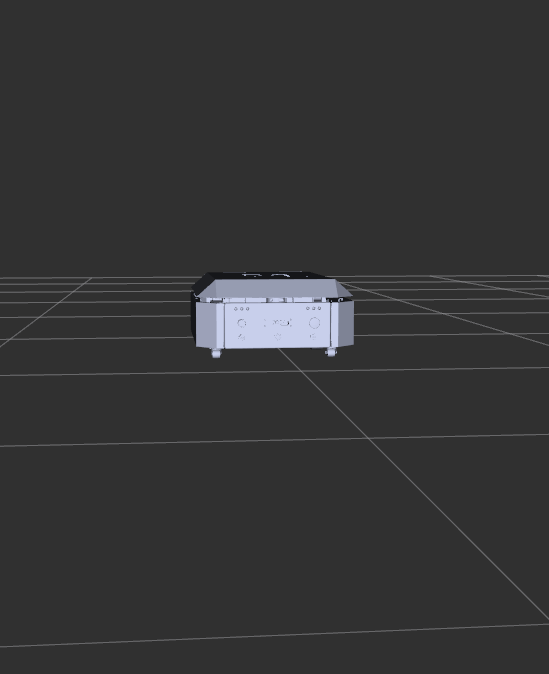
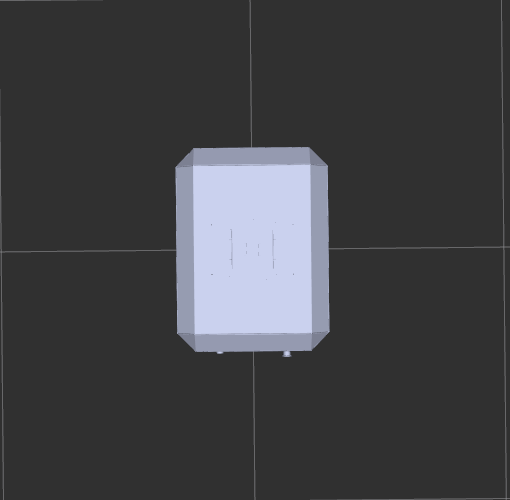

# omr_description

ROS 2 robot description package for an Open Mobile Robot (OMR) — a differential-drive platform with four passive caster wheels and a 2D LiDAR sensor. The package provides the URDF/Xacro model, Gazebo Harmonic simulation integration, a ROS–Gazebo bridge, and a Dev Container for zero-setup development.

---

## Table of Contents

- [Robot Overview](#robot-overview)
- [Repository Structure](#repository-structure)
- [Dev Container Setup](#dev-container-setup)
  - [What the Container Provides](#what-the-container-provides)
  - [Opening in VS Code](#opening-in-vs-code)
  - [Without a Container](#without-a-container)
- [Building the Workspace](#building-the-workspace)
- [Running](#running)
  - [RViz Visualization (no simulator)](#rviz-visualization-no-simulator)
  - [Gazebo Harmonic Simulation](#gazebo-harmonic-simulation)
  - [Manual Teleoperation](#manual-teleoperation)
- [Robot Model Details](#robot-model-details)
  - [Links](#links)
  - [Joints](#joints)
  - [Sensors](#sensors)
- [Gazebo Simulation Details](#gazebo-simulation-details)
  - [Plugins](#plugins)
  - [Performance Limits](#performance-limits)
  - [Friction Model](#friction-model)
  - [Worlds](#worlds)
- [ROS–Gazebo Bridge](#rosgazebo-bridge)
- [ROS 2 Topics Reference](#ros-2-topics-reference)
- [Launch File Arguments](#launch-file-arguments)
- [Package Dependencies](#package-dependencies)

---

## Robot Overview

| Property | Value |
|---|---|
| Drive type | Differential drive |
| Drive wheels | 2 × large wheels (left / right) |
| Passive wheels | 4 × caster assemblies (FL, FR, BL, BR) |
| Wheel radius | 110 mm |
| Wheel separation | 407.5 mm |
| Total robot mass | ~6.5 kg |
| Sensor | 2D GPU LiDAR — 360°, 10 m range, 10 Hz |
| Simulation | Gazebo Harmonic (`gz-sim`) |
| ROS version | ROS 2 Jazzy (Ubuntu 24.04) |

---

## Robot Renders

| Perspective | Front |
|---|---|
|  |  |

| Top | Bottom |
|---|---|
|  |  |

---

## Repository Structure

```
open_mobile_robot_ws/               ← workspace root
├── .devcontainer/                  ← workspace-level dev container
│   ├── devcontainer.json
│   └── Dockerfile
└── src/
    ├── omr_description/            ← this package
    │   ├── .devcontainer/          ← package-level dev container (standalone)
    │   │   ├── devcontainer.json
    │   │   └── Dockerfile
    │   ├── config/
    │   │   └── gz_bridge.yaml      ← ROS–Gazebo topic bridge config
    │   ├── launch/
    │   │   ├── launch.py           ← RViz + robot_state_publisher (no sim)
    │   │   └── gz_simulator.launch.py  ← Full Gazebo Harmonic bringup
    │   ├── meshes/
    │   │   ├── collision/          ← STL meshes for physics (simplified)
    │   │   └── visual/             ← STL meshes for rendering
    │   ├── urdf/
    │   │   ├── robo_urdf.urdf.xacro    ← Main robot model (Xacro)
    │   │   ├── gazebo_control.xacro    ← Gazebo plugins + material props
    │   │   └── robot.sdf               ← SDF version of the model
    │   ├── world/
    │   │   ├── walled_world.sdf    ← Enclosed arena (default)
    │   │   └── depot.sdf           ← Warehouse environment
    │   ├── package.xml
    │   ├── setup.py
    │   └── README.md
    └── my_robot_nav/               ← Navigation2 bringup package
```

---

## Dev Container Setup

This package ships its **own** `.devcontainer/` so it works as a standalone repo — clone only `omr_description`, open it in VS Code, and the full simulation environment is ready without any manual setup.

> A workspace-level `.devcontainer/` also exists at `open_mobile_robot_ws/.devcontainer/` for use when working with multiple packages (e.g. `my_robot_nav`) together.

### What the Container Provides

| Component | Version |
|---|---|
| Base OS | Ubuntu 24.04 (Noble) |
| ROS 2 | Jazzy Jalisco |
| Gazebo | Harmonic (`gz-harmonic`) |
| ros_gz stack | `ros-jazzy-ros-gz`, `ros-gz-bridge`, `ros-gz-sim` |
| robot_state_publisher | included |
| joint_state_publisher + GUI | included |
| xacro | included |
| RViz 2 | included |
| Nav2 | `ros-jazzy-nav2-bringup` |
| Teleop | `ros-jazzy-teleop-twist-keyboard` |
| GUI forwarding | X11 via `$DISPLAY` + `/tmp/.X11-unix` |
| GPU | NVIDIA passthrough (`--gpus=all`) for `gpu_lidar` rendering |

**Dockerfile** (`open_mobile_robot_ws/.devcontainer/Dockerfile`):
```dockerfile
FROM osrf/ros:jazzy-desktop

RUN apt-get update && apt-get install -y --no-install-recommends \
    gz-harmonic \
    ros-jazzy-ros-gz ros-jazzy-ros-gz-bridge ros-jazzy-ros-gz-sim \
    ros-jazzy-robot-state-publisher \
    ros-jazzy-joint-state-publisher ros-jazzy-joint-state-publisher-gui \
    ros-jazzy-xacro ros-jazzy-rviz2 \
    ros-jazzy-nav2-bringup \
    ros-jazzy-teleop-twist-keyboard \
    python3-colcon-common-extensions python3-rosdep \
    && rm -rf /var/lib/apt/lists/*

RUN echo "source /opt/ros/jazzy/setup.bash" >> /root/.bashrc
WORKDIR /workspaces/open_mobile_robot_ws
ENV GZ_SIM_RESOURCE_PATH=/workspaces/open_mobile_robot_ws/install/omr_description/share
```

**devcontainer.json** key settings:
- Workspace mounted at `/workspaces/open_mobile_robot_ws`
- `--network=host` so ROS 2 DDS discovery works without extra config
- `postStartCommand` runs `colcon build --symlink-install` automatically on container start
- VS Code extensions: `ms-iot.vscode-ros`, `ms-python.python`, `ms-vscode.cpptools`
- `ROS_DOMAIN_ID=0`, `RMW_IMPLEMENTATION=rmw_fastrtps_cpp`

### Opening in VS Code

1. Install the **Dev Containers** extension (`ms-vscode-remote.remote-containers`) and Docker Engine.

2. On Linux, allow the container to draw windows on your screen:
   ```bash
   xhost +local:docker
   ```

3. Open **this package folder** (not the workspace root) in VS Code:
   ```bash
   code ~/open_mobile_robot_ws/src/omr_description
   ```

4. VS Code detects `.devcontainer/` and shows a prompt — click **Reopen in Container**, or press `Ctrl+Shift+P` → `Dev Containers: Reopen in Container`.

5. The image builds once (~5 min). On completion `postCreateCommand` runs `colcon build --symlink-install` automatically and the workspace is sourced in every new terminal.

6. Open a terminal inside VS Code and go to [Running](#running).

> **No NVIDIA GPU?** Remove `"--gpus=all"` and `"-e", "NVIDIA_DRIVER_CAPABILITIES=all"` from `runArgs` in `.devcontainer/devcontainer.json`. The simulation still works; the LiDAR falls back to CPU ray-casting.

### Without a Container

If you are running locally on Ubuntu 24.04 with ROS 2 Jazzy already installed:

```bash
sudo apt install ros-jazzy-ros-gz \
                 ros-jazzy-robot-state-publisher \
                 ros-jazzy-joint-state-publisher-gui \
                 ros-jazzy-xacro \
                 ros-jazzy-rviz2 \
                 gz-harmonic
```

---

## Building the Workspace

```bash
cd ~/open_mobile_robot_ws
source /opt/ros/jazzy/setup.bash
colcon build --symlink-install
source install/setup.bash
```

Build only this package:
```bash
colcon build --packages-select omr_description
source install/setup.bash
```

---

## Running

### RViz Visualization (no simulator)

Visualize the robot model with an interactive joint-state slider GUI. No Gazebo required.

```bash
ros2 launch omr_description launch.py
```

Optional arguments:
```bash
ros2 launch omr_description launch.py \
  use_rviz:=True \
  use_joint_state_pub:=True \
  urdf_file:=/path/to/custom.urdf
```

### Gazebo Harmonic Simulation

Launch the full simulation stack in the walled world:

```bash
ros2 launch omr_description gz_simulator.launch.py
```

This single command starts:

| Step | What happens |
|---|---|
| 1 | Gazebo Harmonic opens `walled_world.sdf` |
| 2 | Robot spawned at position (0, 0, 0.5) |
| 3 | `robot_state_publisher` reads xacro-processed URDF, publishes `/tf` |
| 4 | `joint_state_publisher` forwards `/joint_states` |
| 5 | `ros_gz_bridge` relays all topics (see [bridge table](#rosgazebo-bridge)) |
| 6 | Static TF `map → odom` published |

To use the depot world instead:
```bash
# Edit gz_simulator.launch.py line 22:
world = os.path.join(bringup_dir, "world", "depot.sdf")
```

### Manual Teleoperation

In a second terminal (source workspace first):

```bash
ros2 run teleop_twist_keyboard teleop_twist_keyboard \
  --ros-args --remap cmd_vel:=/cmd_vel
```

Or send a single velocity command:
```bash
# Forward at 0.3 m/s
ros2 topic pub /cmd_vel geometry_msgs/msg/Twist \
  "{linear: {x: 0.3}, angular: {z: 0.0}}" --once

# Rotate in place at 0.5 rad/s
ros2 topic pub /cmd_vel geometry_msgs/msg/Twist \
  "{linear: {x: 0.0}, angular: {z: 0.5}}" --once

# Stop
ros2 topic pub /cmd_vel geometry_msgs/msg/Twist \
  "{linear: {x: 0.0}, angular: {z: 0.0}}" --once
```

---

## Robot Model Details

The robot model is defined in [`urdf/robo_urdf.urdf.xacro`](urdf/robo_urdf.urdf.xacro) (SolidWorks URDF export) and extended by [`urdf/gazebo_control.xacro`](urdf/gazebo_control.xacro) for simulation properties.

### Links

| Link | Mass (kg) | Collision Geometry | Notes |
|---|---|---|---|
| `base_link` | 4.175 | STL mesh | Robot chassis; inertia from SolidWorks |
| `left_wheel_link` | 1.061 | Cylinder r=0.11 m, l=0.046 m | Left drive wheel |
| `right_wheel_link` | 1.061 | Cylinder r=0.11 m, l=0.046 m | Right drive wheel |
| `fl_caster_link` | 0.022 | STL mesh | Front-left caster fork |
| `fr_caster_link` | 0.022 | STL mesh | Front-right caster fork |
| `bl_caster_link` | 0.022 | STL mesh | Back-left caster fork |
| `br_caster_link` | 0.022 | STL mesh | Back-right caster fork |
| `fl_wheel_link` | 0.027 | Sphere r=0.026 m | Front-left caster ball |
| `fr_wheel_link` | 0.024 | Sphere r=0.026 m | Front-right caster ball |
| `bl_wheel_link` | 0.024 | Sphere r=0.026 m | Back-left caster ball |
| `br_wheel_link` | 0.024 | Sphere r=0.026 m | Back-right caster ball |
| `lidar_link` | 0.168 | STL mesh | 2D LiDAR unit |

### Joints

| Joint | Type | Parent | Child | Axis |
|---|---|---|---|---|
| `left_wheel_joint` | continuous | base_link | left_wheel_link | Y |
| `right_wheel_joint` | continuous | base_link | right_wheel_link | Y |
| `fl_caster_joint` | continuous | base_link | fl_caster_link | Z (free swivel) |
| `fr_caster_joint` | continuous | base_link | fr_caster_link | Z (free swivel) |
| `bl_caster_joint` | continuous | base_link | bl_caster_link | Z (free swivel) |
| `br_caster_joint` | continuous | base_link | br_caster_link | Z (free swivel) |
| `fl_wheel_joint` | continuous | fl_caster_link | fl_wheel_link | Y |
| `fr_wheel_joint` | continuous | fr_caster_link | fr_wheel_link | Y |
| `bl_wheel_joint` | continuous | bl_caster_link | bl_wheel_link | Y |
| `br_wheel_joint` | continuous | br_caster_link | br_wheel_link | Y |
| `lidar_joint` | fixed | base_link | lidar_link | — |

All revolute joints use `damping=0.001`, `friction=0.001`. Traction at drive wheels comes from the Gazebo ODE surface model, not the joint friction value.

### Sensors

**2D GPU LiDAR** mounted on `lidar_link` (x=0.351 m, z=0.168 m from `base_link`):

| Parameter | Value |
|---|---|
| Gazebo type | `gpu_lidar` |
| ROS topic | `/scan` (`sensor_msgs/msg/LaserScan`) |
| Update rate | 10 Hz |
| Horizontal samples | 360 (1° resolution) |
| Angular range | −180° to +180° |
| Min range | 0.1 m |
| Max range | 10.0 m |
| Range resolution | 0.01 m |
| Noise model | Gaussian, mean=0, σ=0.001 m |
| Visualization | Enabled in Gazebo (`<visualize>true</visualize>`) |

---

## Gazebo Simulation Details

All Gazebo-specific configuration lives in [`urdf/gazebo_control.xacro`](urdf/gazebo_control.xacro).

### Plugins

| Plugin | Gazebo system name | Purpose |
|---|---|---|
| Diff-drive controller | `gz-sim-diff-drive-system` | `/cmd_vel` → wheel torques; publishes `/odom` at 50 Hz |
| Joint state publisher | `gz-sim-joint-state-publisher-system` | Publishes all 10 joint angles to `/joint_states` |
| GPU LiDAR sensor | `gpu_lidar` (sensor tag) | Raycasts 360 samples, publishes to `/scan` |

### Performance Limits

| Parameter | Value |
|---|---|
| Max linear velocity | ±1.0 m/s |
| Max angular velocity | ±2.0 rad/s |
| Max linear acceleration | ±0.5 m/s² |
| Max angular acceleration | ±1.0 rad/s² |

### Friction Model

ODE surface friction parameters per link:

| Link group | µ (forward) | µ₂ (lateral) | Notes |
|---|---|---|---|
| Drive wheels | 1.5 | 0.5 | High traction, directional (`fdir1 = 1 0 0`) |
| Caster wheels | 0.01 | 0.01 | Near-frictionless to prevent dragging |
| Base chassis | 0.2 | 0.2 | Moderate; rarely contacts ground |

### Worlds

| File | Description |
|---|---|
| [`world/walled_world.sdf`](world/walled_world.sdf) | Enclosed arena with boundary walls — default simulation environment |
| [`world/depot.sdf`](world/depot.sdf) | Warehouse / depot layout for navigation testing |

Both worlds run with: `Physics` + `UserCommands` + `SceneBroadcaster` + `Sensors` (ogre2 renderer) plugins and a directional sun light.

---

## ROS–Gazebo Bridge

[`config/gz_bridge.yaml`](config/gz_bridge.yaml) configures the `ros_gz_bridge` node to translate between ROS 2 and Gazebo message formats:

| ROS 2 Topic | Message Type | Direction | Source plugin |
|---|---|---|---|
| `/clock` | `rosgraph_msgs/msg/Clock` | GZ → ROS | Gazebo core |
| `/odom` | `nav_msgs/msg/Odometry` | GZ → ROS | DiffDrive |
| `/tf` | `tf2_msgs/msg/TFMessage` | GZ → ROS | DiffDrive |
| `/cmd_vel` | `geometry_msgs/msg/Twist` | ROS → GZ | DiffDrive |
| `/scan` | `sensor_msgs/msg/LaserScan` | GZ → ROS | GPU LiDAR |
| `imu` | `sensor_msgs/msg/Imu` | GZ → ROS | IMU (bridge ready) |
| `/rgb_image` | `sensor_msgs/msg/Image` | GZ → ROS | Camera (bridge ready) |
| `camera/camera_info` | `sensor_msgs/msg/CameraInfo` | GZ → ROS | Camera (bridge ready) |

---

## ROS 2 Topics Reference

| Topic | Type | Publisher | Subscriber |
|---|---|---|---|
| `/cmd_vel` | `geometry_msgs/msg/Twist` | Teleop / Nav2 | Gazebo DiffDrive (via bridge) |
| `/odom` | `nav_msgs/msg/Odometry` | Gazebo DiffDrive | Nav2 / SLAM |
| `/scan` | `sensor_msgs/msg/LaserScan` | Gazebo LiDAR | Nav2 / SLAM / RViz |
| `/joint_states` | `sensor_msgs/msg/JointState` | Gazebo JointState | robot_state_publisher |
| `/robot_description` | `std_msgs/msg/String` | robot_state_publisher | Gazebo spawn / RViz |
| `/tf` | `tf2_msgs/msg/TFMessage` | Gazebo + tf2_ros | RViz / Nav2 |
| `/tf_static` | `tf2_msgs/msg/TFMessage` | tf2_ros static publisher | RViz / Nav2 |
| `/clock` | `rosgraph_msgs/msg/Clock` | Gazebo | All nodes (use_sim_time) |

---

## Launch File Arguments

### `launch.py` — RViz visualization

```bash
ros2 launch omr_description launch.py [arg:=value ...]
```

| Argument | Default | Description |
|---|---|---|
| `urdf_file` | `urdf/robo_urdf.urdf` | Path to compiled URDF |
| `use_robot_state_pub` | `True` | Start `robot_state_publisher` |
| `use_joint_state_pub` | `True` | Start `joint_state_publisher_gui` |
| `use_rviz` | `True` | Start RViz2 |
| `rviz_config_file` | `rviz/view.rviz` | RViz config path |

### `gz_simulator.launch.py` — Gazebo Harmonic

```bash
ros2 launch omr_description gz_simulator.launch.py [arg:=value ...]
```

| Argument | Default | Description |
|---|---|---|
| `use_sim_time` | `True` | All nodes use `/clock` from Gazebo |
| `use_robot_state_pub` | `True` | Start `robot_state_publisher` |

---

## Package Dependencies

| Dependency | Type | Purpose |
|---|---|---|
| `ament_python` | build | Python package build system |
| `robot_state_publisher` | runtime | URDF → TF tree publisher |
| `joint_state_publisher` | runtime | Publishes joint states in simulation |
| `joint_state_publisher_gui` | runtime | Interactive joint sliders in RViz |
| `xacro` | runtime | Processes `.urdf.xacro` → URDF XML |
| `rviz2` | runtime | 3D visualization |
| `ros_gz_sim` | runtime | Gazebo Harmonic ROS 2 integration |
| `ros_gz_bridge` | runtime | Bidirectional ROS 2 ↔ Gazebo topic bridge |
| `tf2_ros` | runtime | Static `map → odom` TF broadcaster |
| `nav2_bringup` | runtime | Navigation2 stack (in `my_robot_nav`) |
| `ament_copyright` | test | License header linting |
| `ament_flake8` | test | Python PEP8 style checks |
| `ament_pep257` | test | Python docstring style checks |
| `python3-pytest` | test | Test runner |
