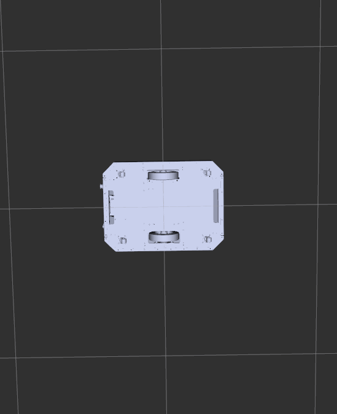

# openamrobot-simulation

ROS 2 simulation repository for the **OpenAMRobot** mobile base — a differential-drive platform with four passive caster wheels and a 2D LiDAR sensor.

---

## Repository Status

**Current maturity level: Experimental**

This repository is under active development and may contain incomplete or unstable features.

This project is intended for:

- Robotics research
- Simulation
- Experimentation
- Education
- ROS 2 development

Production deployment requires independent validation and safety assessment.

---

## Safety Notice

This project is experimental and provided for research, educational, and development purposes.

Users are responsible for:

- Safety validation
- Simulation verification
- Hardware compatibility
- Regulatory compliance
- Deployment suitability

---

## Governance

This repository follows the [OpenAMRobot organization governance framework](https://github.com/openAMRobot/.github).

See: [CONTRIBUTING.md](CONTRIBUTING.md) · [SECURITY.md](SECURITY.md) · [AUTHORS.md](AUTHORS.md) · [CHANGELOG.md](CHANGELOG.md)

---

## Packages

| Package | Contents |
|---|---|
| [`openamrobot_description`](openamrobot_description/) | URDF/Xacro model, STL meshes, RViz visualization launch |
| [`openamrobot_gazebo`](openamrobot_gazebo/) | Gazebo Harmonic worlds, ROS–Gazebo bridge config, simulation launch |

---

## Robot Overview

| Property | Value |
|---|---|
| Drive type | Differential drive |
| Drive wheels | 2 × large wheels (left / right) |
| Passive wheels | 4 × caster assemblies (FL, FR, BL, BR) |
| Wheel radius | 110 mm |
| Wheel separation | 407.5 mm |
| Total robot mass | ~6.5 kg |
| Sensor | 2D GPU LiDAR — 360°, 10 m range, 10 Hz |
| Simulation | Gazebo Harmonic (`gz-sim`) |
| ROS version | ROS 2 Jazzy (Ubuntu 24.04) |

## Robot Renders

| Perspective | Front |
|---|---|
|  |  |

| Top | Bottom |
|---|---|
|  |  |

---

## Repository Structure

```
openamrobot-simulation/
├── openamrobot_description/        ← robot description package
│   ├── launch/
│   │   └── launch.py               ← RViz + robot_state_publisher (no sim)
│   ├── meshes/
│   │   ├── collision/              ← STL meshes for physics
│   │   └── visual/                 ← STL meshes for rendering
│   ├── urdf/
│   │   ├── robo_urdf.urdf.xacro    ← main robot model
│   │   ├── gazebo_control.xacro    ← Gazebo plugins + surface properties
│   │   └── robot.sdf
│   ├── package.xml
│   └── setup.py
├── openamrobot_gazebo/             ← Gazebo simulation package
│   ├── config/
│   │   └── gz_bridge.yaml          ← ROS–Gazebo topic bridge config
│   ├── launch/
│   │   └── gz_simulator.launch.py  ← full Gazebo Harmonic bringup
│   ├── worlds/
│   │   ├── walled_world.sdf        ← enclosed arena (default)
│   │   └── depot.sdf               ← warehouse environment
│   ├── package.xml
│   └── setup.py
├── docs/
│   └── images/
├── .devcontainer/
└── README.md
```

---

## Dev Container Setup

The `.devcontainer/` at the repo root provides a zero-setup environment with ROS 2 Jazzy + Gazebo Harmonic.

1. Install the **Dev Containers** VS Code extension and Docker Engine.
2. Allow the container to forward GUI windows:
   ```bash
   xhost +local:docker
   ```
3. Open the repo folder in VS Code and click **Reopen in Container**.
4. The image builds once (~5 min); `colcon build --symlink-install` runs automatically.

> **No NVIDIA GPU?** Remove `"--gpus=all"` and `"-e", "NVIDIA_DRIVER_CAPABILITIES=all"` from `runArgs` in `.devcontainer/devcontainer.json`.

### Without a Container

```bash
sudo apt install ros-jazzy-ros-gz \
                 ros-jazzy-robot-state-publisher \
                 ros-jazzy-joint-state-publisher-gui \
                 ros-jazzy-xacro \
                 ros-jazzy-rviz2 \
                 gz-harmonic
```

---

## Building the Workspace

```bash
cd ~/open_mobile_robot_ws
source /opt/ros/jazzy/setup.bash
colcon build --symlink-install
source install/setup.bash
```

Build individual packages:
```bash
colcon build --packages-select openamrobot_description openamrobot_gazebo
source install/setup.bash
```

---

## Running

### RViz Visualization (no simulator)

```bash
ros2 launch openamrobot_description launch.py
```

### Gazebo Harmonic Simulation

```bash
ros2 launch openamrobot_gazebo gz_simulator.launch.py
```

This starts: Gazebo Harmonic with `walled_world.sdf`, spawns the robot, starts `robot_state_publisher`, `joint_state_publisher`, and the ROS–Gazebo bridge.

To use the depot world, edit [openamrobot_gazebo/launch/gz_simulator.launch.py](openamrobot_gazebo/launch/gz_simulator.launch.py) line referencing `walled_world.sdf` → `depot.sdf`.

### Manual Teleoperation

```bash
ros2 run teleop_twist_keyboard teleop_twist_keyboard \
  --ros-args --remap cmd_vel:=/cmd_vel
```

---

## ROS 2 Topics

| Topic | Type | Direction |
|---|---|---|
| `/cmd_vel` | `geometry_msgs/msg/Twist` | ROS → Gazebo |
| `/odom` | `nav_msgs/msg/Odometry` | Gazebo → ROS |
| `/scan` | `sensor_msgs/msg/LaserScan` | Gazebo → ROS |
| `/joint_states` | `sensor_msgs/msg/JointState` | Gazebo → ROS |
| `/robot_description` | `std_msgs/msg/String` | robot_state_publisher |
| `/tf` | `tf2_msgs/msg/TFMessage` | Gazebo → ROS |
| `/clock` | `rosgraph_msgs/msg/Clock` | Gazebo → ROS |
